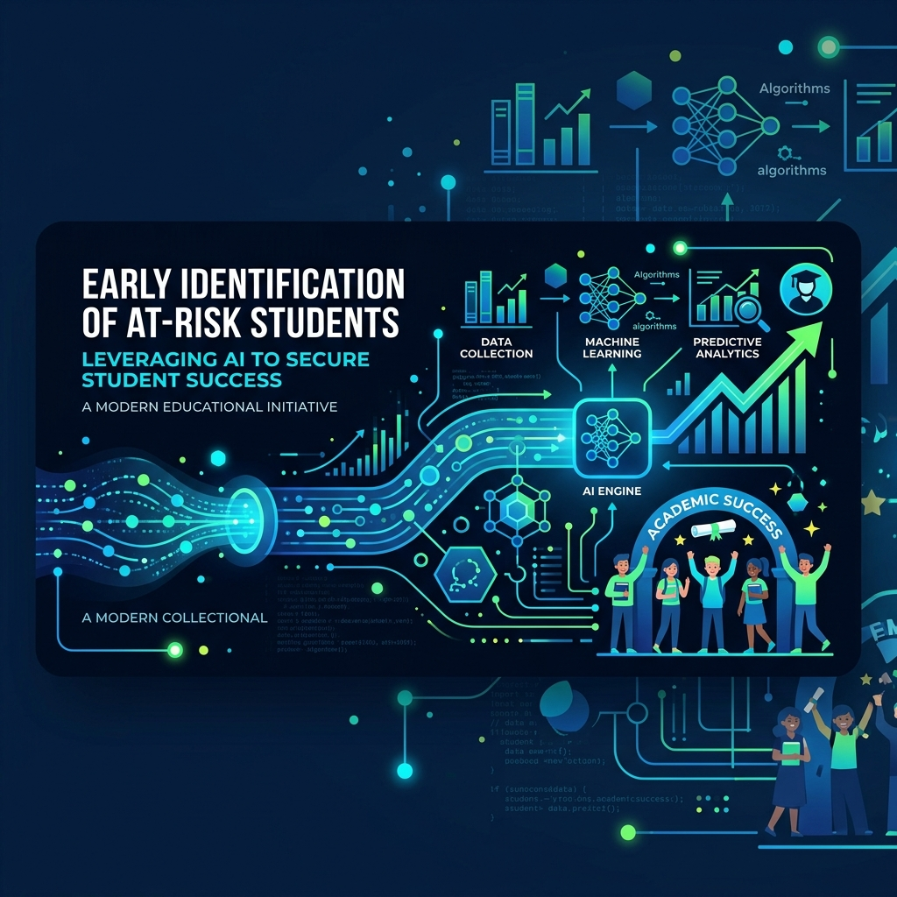
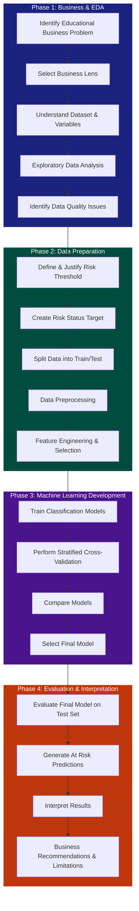

# Early Identification of At-Risk Students Through Final Mathematics Grade Prediction

This repository contains the end-to-end machine learning project aimed at identifying secondary school students who are at risk of achieving poor final mathematics results. 

The primary business objective is to empower educational institutions with a data-driven approach to spot students who might require additional academic support *before* their final grades are assigned. 

## Business Problem & Objective
**Domain:** Education  
**Problem Statement:** In what way can an educational institution make use of a student's previous academic performance and other relevant student characteristics in order to identify those students who are likely to attain poor final Mathematics results?

Rather than predicting the exact numerical grade, this project formulates the problem as **At Risk Student Identification (Binary Classification)**. This provides a more meaningful interpretation for academic staff, enabling them to make future academic decisions and plan interventions.

## The Machine Learning Task
- **Input Features:** `Student Information + G1 (first-period grade) + G2 (second-period grade)`
- **Output:** `At Risk` / `Not At Risk`
- **Target Variable Creation:** The actual final grade (`G3`) is strictly used to define the `Risk Status` target based on a justified risk threshold (e.g., `G3 < 10`). 
- **Leakage Prevention:** To reflect a realistic prediction situation, `G3` is heavily excluded from the model's input features to prevent target leakage.

---

## 📊 End-to-End Project Workflow

The project follows a structured machine learning lifecycle, divided among four core team members. 

## 👥 Core Responsibilities

| Team Member | Phase | Core Responsibility |
| :--- | :--- | :--- |
| **IT24101546** | Business & EDA | Business problem framing, stakeholder analysis, Exploratory Data Analysis, and Risk-threshold justification. |
| **IT24100038** | Data Preparation | Data quality assessment, preprocessing, feature engineering, and strict `Risk Status` target preparation without data leakage. |
| **IT24101024** | ML Development | Classification model development (Logistic Regression, Decision Trees, RF, GBM, SVM), cross-validation, and hyperparameter tuning. |
| **IT24102210** | Evaluation & Business | Final evaluation (Recall, Precision, ROC-AUC), interpreting confusion matrices, analyzing limitations, and responsible AI recommendations. |

## 📈 Model Evaluation Strategy
Because the primary goal is to identify students who *may* be at risk, the evaluation metrics prioritize **Recall** (to minimize false negatives, where an at-risk student slips through). **Precision** is also balanced using the **F1-score** to ensure the school's resources aren't overwhelmed by false alarms. 

A Dummy Classifier will be established as a simple baseline, followed by comparisons across complex models using stratified cross-validation on the training set, leaving a separate unseen test set for final evaluation.

## ⚠️ Initial Limitations & Responsible Use
- **Dataset Generalizability:** Models trained on this specific UCI dataset may only generalize to specific educational contexts.
- **Risk Threshold Sensitivity:** Class imbalance and predictive outcomes heavily depend on the chosen threshold for `G3`. 
- **Responsible Use:** The model serves purely as a **decision-support tool**, not an automatic decision-maker. Students must not be labeled, disadvantaged, or subjected to academic decisions solely based on these machine learning predictions. Human judgement is paramount.